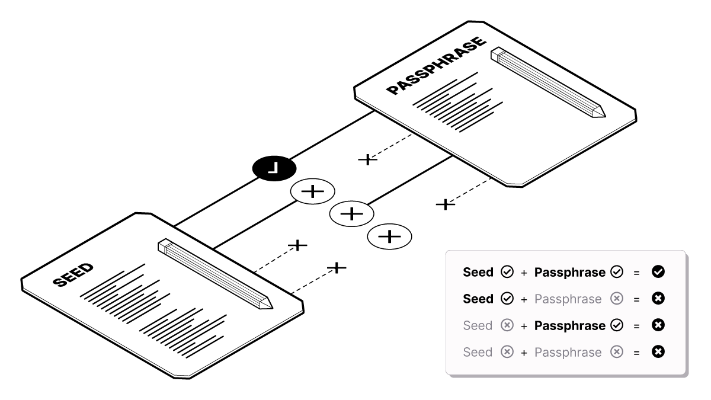

# Sécuriser le portefeuille : aperçu des notions de base

### **Il existe 2 mécanismes de sécurité prévenant le vol ou la perte accidentelle de vos bitcoins :**

1. Code de sauvegarde sous forme de phrase mnémonique
2. Phrases secrètes de portefeuille

#### **Si vous perdez votre ordinateur ou votre fichier portefeuille**

* La sauvegarde mnémonique vous permet de récupérer vos portefeuilles Bitcoin
* Votre phrase secrète vous permet de déverrouiller les portefeuilles Bitcoin récupérés


### <mark style="color:red;">**AVERTISSEMENT**</mark>

La sauvegarde mnémonique ainsi que la phrase secrète sont tous deux nécessaires à la récupération d'un portefeuille perdu. **Si vous perdez la sauvegarde mnémonique OU la phrase secrète, vous ne pourrez pas récupérer l'accès à vos bitcoins si vous perdez votre ordinateur.**


#### **Si quelqu'un vole votre ordinateur**

Le mot de passe protège l'accès non autorisé à vos fonds sur Wasabi Wallet, s'ils devaient se retrouver entre de mauvaises mains.

#### **Si quelqu'un vole votre ordinateur et votre sauvegarde mnémonique**

L'individu aura accès à votre portefeuille mais vos fonds seront protégés grâce à la phrase secrète.

#### **Si quelqu'un vole votre sauvegarde mnémonique**

Les fonds ne seront pas accessibles sans le mot de passe.


### <mark style="color:red;">**AVERTISSEMENT**</mark>

Si quelqu'un a accès autant à votre sauvegarde mnémonique qu'à votre phrase secrète, cet individu peut voler vos bitcoins! **NE GARDEZ PAS CES COPIES AU MÊME ENDROIT!**


