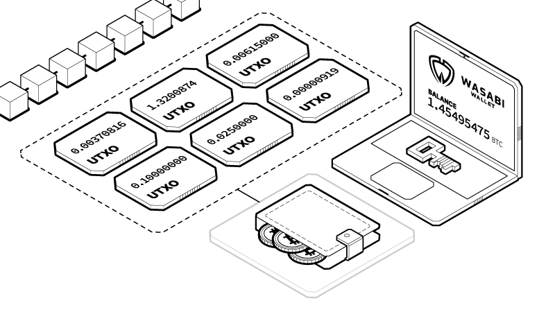

# Survol

## À propos de CoinJoin avec Wasabi Wallet

L'implémentation CoinJoin de Wasabi est à code-source libre et exclusivement Bitcoin, sur ordinateur. Le portefeuille Wasabi est axé sur la confidentialité et offre une sécurité élevée en plus de s'avérer facile d'utilisation une fois sa légère courbe d'apprentissage surmontée. Il permet un garde autonome du bitcoin et l'accès aux fonds ne peut jamais être restreint. Il a une grande communauté d'utilisateurs et l'équipe de développement est transparente et réputée.

### **Coin Control**

Wasabi implémente par défaut une technique nommée Coin Control (Contrôle des Pièces). Lorsque vous envoyez des transactions, vous devez sélectionner les pièces individuelles disponibles dans votre portefeuille, également appelées Unspent Transaction Outputs (UTXO), que vous souhaitez envoyer. Vous pouvez en sélectionner plusieurs à la fois si le solde que vous souhaitez envoyer dépasse le solde d'une pièce.

Pensez aux bitcoins comme de véritables pièces ou billets physiques de différents montants dans votre poche. Lorsque vous les dépensez, vous combinez la monnaie et vous en récupérez une nouvelle en retour.

### **Étiquetage**

Pour chaque transaction Bitcoin que vous envoyez et recevez, il est important d'identifier qui est au fait de cette transaction. L'étiquette sert à nous assurer que nous savons qui nous envoie des pièces et à qui nous les envoyons. Les transactions Bitcoin étant publiques, nous voulons éviter autant que possible de révéler l'historique de nos transactions à quiconque pourrait nous surveiller.

Ainsi, par exemple, si vous recevez des bitcoins en guise de paiement pour un travail effectué, vous pouvez inscrire « Bull Bitcoin paiement ».

Maintenant, si vous souhaitez les vendre sur la plateforme Bull Bitcoin, vous pouvez utiliser la même pièce portant l'étiquette « Bull Bitcoin » et ajouter l'étiquette « Bull Bitcoin vendu », puisque c'est le même observateur de cette pièce, c'est-à-dire Bull Bitcoin.&#x20;

Si toutefois vous souhaitez acheter quelque chose et vous ne voulez pas que votre employeur ne le sache, vous utiliserez une pièce différente pour qu'il soit incapable d'observer l'historique des transactions de la pièce.
